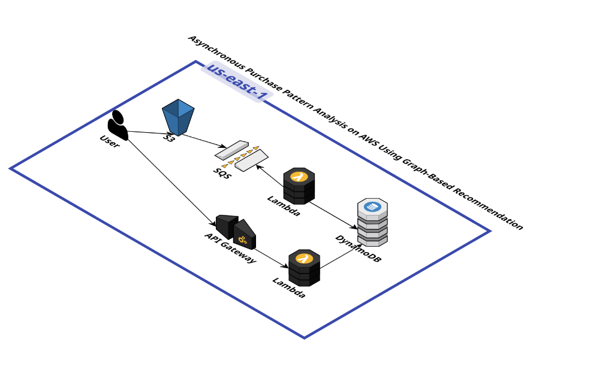

# Lambda Ingestion - Asynchronous Purchase Pattern Analysis

Este proyecto implementa el componente de ingestión de datos dentro de la arquitectura de análisis de patrones de compra.

## Arquitectura

Tal como se define en el diseño del sistema, el flujo de ingestión es totalmente asíncrono y dirigido por eventos:

1.  **S3 (Origen)**: El usuario sube un archivo de datos (ej. `tickets.csv`) a un bucket de Amazon S3.
2.  **SQS (Desacoplamiento)**: S3 envía automáticamente una notificación de evento a una cola de Amazon SQS.
3.  **Lambda (Procesamiento)**: Esta función Lambda está suscrita a la cola SQS y consume los eventos a medida que llegan.
4.  **DynamoDB (Persistencia)**: La Lambda procesa el archivo referenciado y almacena los datos estructurados en una tabla de DynamoDB.

## Descripción de la Función

La función Lambda (`ingestion/lambda_function.py`) está diseñada específicamente para manejar eventos de **SQS**.

### Flujo de Ejecución Detallado

1.  **Recepción del Mensaje**: La Lambda recibe un evento `SQSEvent` que contiene una lista de `Records`.
2.  **Parsing del Body**: Cada registro de SQS contiene un `body` que es una cadena JSON. Este `body` se parsea para extraer la estructura del evento de notificación de S3 (`S3Event`).
3.  **Extracción de Metadatos**: Se obtienen el nombre del `bucket` y la `key` (nombre del archivo) desde el evento de S3.
4.  **Descarga**: El archivo CSV se descarga desde S3 al almacenamiento temporal de la Lambda (`/tmp`).
5.  **Ingestión**: Se lee el archivo CSV y se insertan los registros en la tabla de DynamoDB definida.

## Configuración

### Variables de Entorno

*   `DYNAMODB_TABLE`: Nombre de la tabla de DynamoDB destino. Valor por defecto: `Tickets`.

### Estructura de Datos (CSV)

El archivo de entrada debe tener las siguientes columnas:
`ticket_id`, `product`, `basket_id`, `timestamp`, `category`, `quantity`, `store`.

## Despliegue

El código fuente se encuentra en el directorio `ingestion/`.

1.  Asegúrate de que la Lambda tenga permisos IAM para:
    *   `sqs:ReceiveMessage`, `sqs:DeleteMessage`, `sqs:GetQueueAttributes` (para leer de la cola).
    *   `s3:GetObject` (para descargar el archivo).
    *   `dynamodb:BatchWriteItem` o `dynamodb:PutItem` (para escribir en la tabla).
2.  Configura el **Trigger** de la Lambda para que sea la cola SQS correspondiente.
